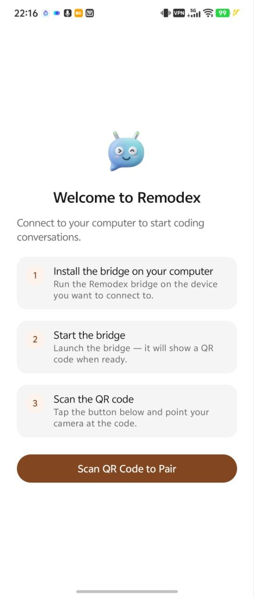
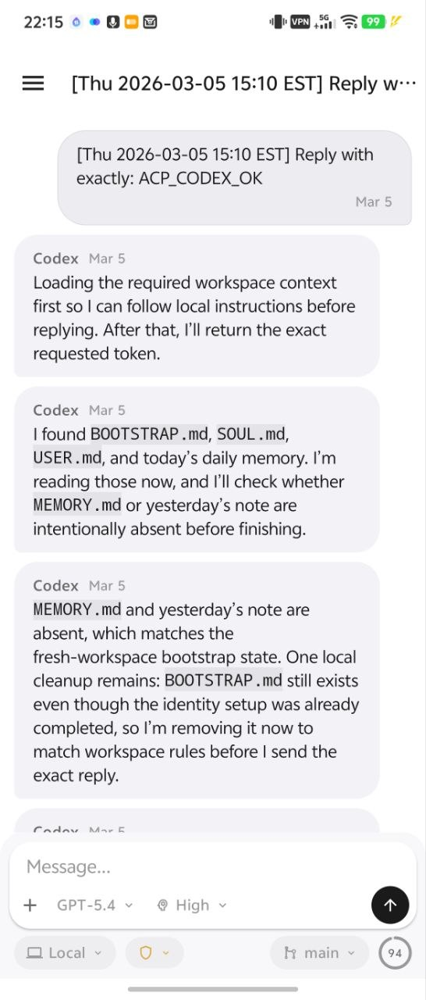
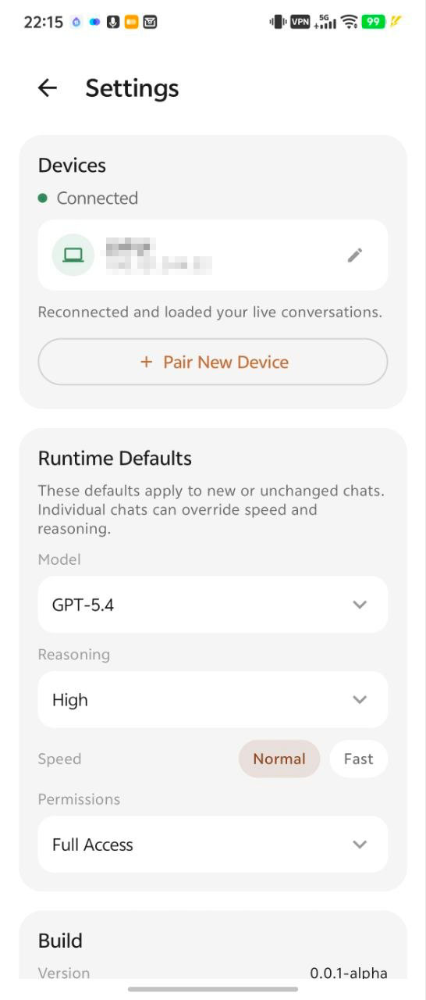
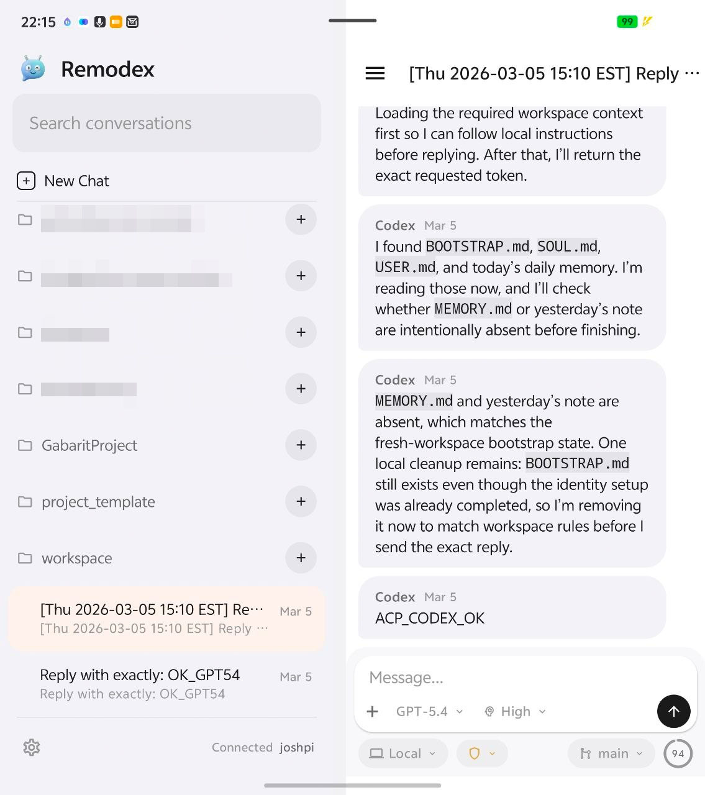

<p align="center">
  
</p>

# Remodex Android

> Alpha, personal-use, lightly maintained.

Control Codex on your device from Android. An unofficial Android client for [Remodex](https://github.com/Emanuele-web04/remodex), with compatible bridge and relay updates for a local-first, self-hostable setup.

Derived from the upstream Remodex work by Emanuele Di Pietro. This public repo focuses on the Android client plus the bridge and relay pieces needed to use it from source. It does not include the upstream iOS source tree, and it is not the official Android port of Remodex. It is intended to stay compatible with the upstream iOS app and protocol where that shared bridge/relay behavior is preserved.

<p align="center">
  
</p>

<table align="center">
  <tr>
    <td align="center"></td>
    <td align="center"></td>
    <td align="center"></td>
  </tr>
</table>

## Current Status

Remodex Android is an early but usable self-hostable Android client. The current public snapshot supports:

- QR pairing from Android
- trusted reconnect
- thread list and thread detail
- text send
- stop / continue controls
- structured timeline rendering
- image send and basic history image handling
- local-first self-hosting with the included bridge and relay code

This is a 100% vibe-coded personal project. The author started with effectively zero Android development knowledge, built this mainly for personal use, and has only tested it on the author's own Android hardware. The host side has been tested on both Raspberry Pi and macOS devices running Codex CLI. Expect rough edges. Codex itself may ship an official remote experience soon, so maintenance here may stay very light.

If this repo is useful to you, the safest assumption is:

- treat it as an early alpha
- expect best-effort maintenance only
- feel free to fork it and take it in your own direction

## Tested On / Not Tested On

Tested on:

- the author's own Android devices
- host-side Codex CLI setups on Raspberry Pi and macOS
- local LAN and private-network usage

Not tested on:

- a broad Android device matrix
- polished multi-user or production-style deployments
- public internet relay setups validated end to end by the author

## What This Repo Includes

- `app/`: the Android client
- `phodex-bridge/`: the local bridge that runs next to Codex on your device
- `relay/`: the public relay process used for pairing and trusted reconnect
- `Docs/`: architecture, self-hosting, project history, and durable decisions

What this repo does not include:

- the upstream iOS source tree
- any hosted production relay default
- any private build defaults, credentials, or deployment secrets

## Relationship To Upstream Remodex

- Upstream project: [Emanuele-web04/remodex](https://github.com/Emanuele-web04/remodex)
- Upstream focus: iPhone client plus shared bridge/relay stack
- This repo's focus: Android client plus the compatible bridge/relay changes required to use it

If you want the upstream iOS app or the original repository history, use the upstream project directly.

## What Changed From Upstream

Compared with the upstream Remodex repo, this project mainly does three things:

- adds a native Android client
- keeps the bridge and relay in-tree so the Android client can actually be used from source
- updates the bridge and relay to better support multi-device trust while staying compatible with the upstream iOS app flow

The bridge and relay changes in this repo are still meant to preserve the shared pairing and secure transport contract rather than invent a separate Android-only backend.

## Self-Hosting Model

This repo is meant to be self-hostable and local-first:

- Codex still runs on your own device
- the bridge still runs on your own device
- the relay is only a transport layer
- the Android app pairs once with a QR code, then reuses trusted reconnect

You should assume that you will run one of these setups:

1. local testing with `./run-local-remodex.sh`
2. your own relay endpoint passed through `REMODEX_RELAY`

Recommended real-world path:

- use local LAN only for quick testing
- use Tailscale or another stable private overlay for normal day-to-day use

Important reality check:

- the codebase supports a self-hosted `wss://` relay behind your own reverse proxy
- the upstream project documents that kind of setup
- this Android fork has not been meaningfully validated by the author on a public internet deployment
- so public relay setups should be treated as possible in theory, but unverified here in practice

If you want the highest chance of success, use a private network path such as Tailscale first.

Start with:

```sh
git clone https://github.com/lampten/remodex-android.git
cd remodex-android
./run-local-remodex.sh
```

Then build and install the Android app from `app/`.

For the full setup guide, read [Docs/self-hosting.md](Docs/self-hosting.md) and [SELF_HOSTING_MODEL.md](SELF_HOSTING_MODEL.md).

## Development Notes

- Android stack: Kotlin + Jetpack Compose + Material 3
- Bridge package/CLI name remains `remodex` in this repo for compatibility
- The included bridge and relay code are part of the Android source distribution because they are needed for self-hostable use
- This public repo keeps a clean new history; the larger private task archive stays out of the public tree

## Maintenance

This repository is lightly maintained.

- bug reports are fine
- PRs are unlikely to be accepted
- maintenance will probably only happen when the author needs it personally
- if you want to move faster, fork it

Read [CONTRIBUTING.md](CONTRIBUTING.md) before opening anything non-trivial.

## License

This repository uses the [ISC License](LICENSE).

Because this work is derived in part from the upstream Remodex project, keep the upstream attribution and license notice intact when redistributing modified versions.
